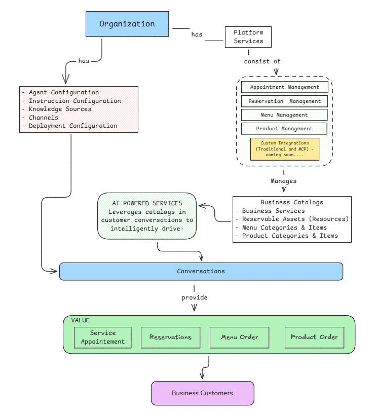

# WIIL JavaScript SDK

Official JavaScript/TypeScript SDK for the [WIIL Platform](https://console.wiil.io) - AI-powered conversational services platform for intelligent customer interactions, voice processing, real-time translation, and business management.

[](https://www.typescriptlang.org/)
[](https://opensource.org/licenses/MIT)

## Features

- ✅ **Type-Safe** - Full TypeScript support with comprehensive type definitions
- ✅ **Production-Grade** - Built for enterprise use with robust error handling
- ✅ **Validated** - Runtime validation using Zod schemas
- ✅ **Well-Documented** - Comprehensive JSDoc comments and API documentation
- ✅ **Tested** - Extensive test coverage with Vitest
- ✅ **Modern** - ES2023 JavaScript, async/await, Promise-based
- ✅ **Comprehensive** - Access to all WIIL Platform domains

## Installation

```bash
npm install wiil-js
```

```bash
yarn add wiil-js
```

```bash
pnpm add wiil-js
```

## Quick Start

```typescript
import { WiilClient } from 'wiil-js';

// Initialize the client with your API key
const client = new WiilClient({
  apiKey: process.env.WIIL_API_KEY!
});
```

## Usage Examples

### 1. Dynamic Agent Setup (Recommended)

The Dynamic Agent Setup API is the fastest way to deploy AI agents. Instead of making 7+ separate API calls, deploy a fully functional agent with a single call.

#### Phone Agent - Single Call Deployment

```typescript
import { WiilClient } from 'wiil-js';
import { BusinessSupportServices } from 'wiil-core-js';

const client = new WiilClient({
  apiKey: process.env.WIIL_API_KEY!
});

const result = await client.dynamicPhoneAgent.create({
  assistantName: 'Sarah',
  capabilities: [BusinessSupportServices.APPOINTMENT_MANAGEMENT],
});

console.log('Phone number:', result.phoneNumber);
console.log('Agent ID:', result.agentConfigurationId);
```

#### Web Agent - Single Call Deployment

```typescript
import { WiilClient } from 'wiil-js';
import { BusinessSupportServices } from 'wiil-core-js';

const client = new WiilClient({
  apiKey: process.env.WIIL_API_KEY!
});

const result = await client.dynamicWebAgent.create({
  assistantName: 'Emma',
  websiteUrl: 'https://example.com',
  capabilities: [BusinessSupportServices.APPOINTMENT_MANAGEMENT],
});

console.log('Integration snippets:', result.integrationSnippets);
console.log('Agent ID:', result.agentConfigurationId);
```

#### Dynamic Agent with Chained Configuration

Chained configuration (STT/TTS) works for both phone and web agents.

```typescript
import { WiilClient } from 'wiil-js';
import {
  BusinessSupportServices,
  AgentRoleTemplateIdentifier,
  SupportedProprietor
} from 'wiil-core-js';

const client = new WiilClient({
  apiKey: process.env.WIIL_API_KEY!
});

// Chained configuration options (same for phone and web)
const chainedConfig = {
  // Required
  assistantName: 'Marcus',
  capabilities: [
    BusinessSupportServices.APPOINTMENT_MANAGEMENT,
    BusinessSupportServices.PRODUCT_ORDER_MANAGEMENT
  ],

  // Optional - Role & Language
  role_template_identifier: AgentRoleTemplateIdentifier.CUSTOMER_SUPPORT_GENERAL,
  language: 'en-US',

  // Optional - Chained Configuration (STT/TTS)
  sttConfiguration: {
    providerType: SupportedProprietor.DEEPGRAM,
    providerModelId: 'nova-2',
    languageId: 'en-US'
  },
  ttsConfiguration: {
    providerType: SupportedProprietor.ELEVENLABS,
    providerModelId: 'eleven_turbo_v2',
    languageId: 'en-US',
    voiceId: 'voice_rachel'
  }
};

// Phone Agent with chained config
const phoneAgent = await client.dynamicPhoneAgent.create(chainedConfig);
console.log('Phone number:', phoneAgent.phoneNumber);

// Web Agent with chained config
const webAgent = await client.dynamicWebAgent.create({
  ...chainedConfig,
  websiteUrl: 'https://example.com'
});
console.log('Widget snippets:', webAgent.integrationSnippets);
```

#### Dynamic Agent Operations

```typescript
// Create
const created = await client.dynamicPhoneAgent.create({ ... });

// Update (partial)
const updated = await client.dynamicPhoneAgent.update({
  id: 'agent_123',
  assistantName: 'Nathan'
});

// Delete
const deleted = await client.dynamicPhoneAgent.delete('agent_123');
```

For complete Dynamic Agent Setup documentation, see the [Dynamic Agent Setup Guide](./examples/dynamic-agent-setup-guide.md).

---

### 2. Service Configuration (Traditional Setup)

For fine-grained control over each configuration component, use the traditional multi-step setup.

#### Account Management

##### Organizations

```typescript
// Get your organization (read-only)
const org = await client.organizations.get();
console.log('Organization:', org.companyName);
```

##### Projects

```typescript
// Create a project
const project = await client.projects.create({
  name: 'Production Environment',
  description: 'Main production deployment'
});

// Get a project
const project = await client.projects.get('proj_123');

// Get the default project
const defaultProject = await client.projects.getDefault();

// Update a project
const updated = await client.projects.update({
  id: 'proj_123',
  name: 'Production Environment v2'
});

// Delete a project
const deleted = await client.projects.delete('proj_123');

// List projects with pagination
const projects = await client.projects.list({
  page: 1,
  pageSize: 20,
  sortBy: 'name',
  sortDirection: 'asc'
});
```

#### Agent Configurations

```typescript
// Get default multi-mode model
const defaultModel = await client.supportModels.getDefaultMultiMode();

// Create an agent configuration
const agent = await client.agentConfigs.create({
  agentName: 'Customer Support Agent',
  modelId: defaultModel.modelId,
  instructionConfigurationId: 'instruction_123'
});

// Get agent configuration
const agent = await client.agentConfigs.get('agent_123');

// Update agent configuration
const updated = await client.agentConfigs.update({
  id: 'agent_123',
  agentName: 'Updated Agent Name'
});

// Delete agent configuration
await client.agentConfigs.delete('agent_123');

// List agent configurations
const agents = await client.agentConfigs.list({ page: 1, pageSize: 20 });
```

#### Deployment Channels

```typescript
// Create a web chat channel
const webChannel = await client.deploymentChannels.create({
  channelName: 'Website Live Chat',
  deploymentType: 'WEB',
  channelIdentifier: 'https://example.com',
  recordingEnabled: true,
  configuration: {
    communicationType: 'TEXT',
    widgetConfiguration: {
      position: 'right'
    }
  }
});

// Get channel by ID
const channel = await client.deploymentChannels.get(webChannel.id);

// List channels by type
const webChannels = await client.deploymentChannels.listByType('WEB', {
  page: 1,
  pageSize: 20
});
```

#### Conversation & Knowledge Sources

```typescript
// Get conversation configuration
const config = await client.conversationConfigs.get('config_123');

// List conversation configurations
const configs = await client.conversationConfigs.list();

// Get knowledge source
const source = await client.knowledgeSources.get('source_123');

// List knowledge sources
const sources = await client.knowledgeSources.list();
```

---

### 3. Business Management

Catalog management and AI-powered transactional operations.

#### Business Services

```typescript
// Create a business service
const service = await client.services.create({
  name: 'Hair Styling',
  description: 'Professional hair styling service',
  duration: 60,
  bufferTime: 15,
  price: 75.00,
  isBookable: true,
  isActive: true
});

// Get service
const service = await client.services.get('service_123');

// List services
const services = await client.services.list({
  page: 1,
  pageSize: 20
});
```

#### Customers

```typescript
// Create a customer
const customer = await client.customers.create({
  name: 'John Doe',
  email: 'john@example.com',
  phone: '+1234567890'
});

// Get customer
const customer = await client.customers.get('customer_123');

// List customers
const customers = await client.customers.list();
```

#### Menus

```typescript
// Create a menu category
const category = await client.menus.createCategory({
  name: 'Appetizers',
  description: 'Start your meal right',
  displayOrder: 1
});

// Create a menu item
const item = await client.menus.createItem({
  name: 'Caesar Salad',
  description: 'Fresh romaine with house-made dressing',
  price: 9.99,
  categoryId: 'cat_123',
  ingredients: ['romaine lettuce', 'parmesan', 'croutons', 'caesar dressing'],
  allergens: ['dairy', 'gluten', 'eggs'],
  nutritionalInfo: {
    calories: 320,
    protein: 8,
    carbs: 22,
    fat: 18
  },
  isAvailable: true,
  preparationTime: 10,
  isActive: true,
  displayOrder: 1
});

// List menu categories
const categories = await client.menus.listCategories({
  page: 1,
  pageSize: 20
});
```

#### Products

```typescript
// Create a product category
const category = await client.products.createCategory({
  name: 'Electronics',
  description: 'Electronic devices and accessories',
  displayOrder: 1
});

// Create a product
const product = await client.products.create({
  name: 'Wireless Mouse',
  description: 'Ergonomic wireless mouse with 6 buttons',
  price: 29.99,
  sku: 'WM-2024-BLK',
  barcode: '123456789012',
  categoryId: 'cat_123',
  brand: 'TechBrand',
  trackInventory: true,
  stockQuantity: 150,
  lowStockThreshold: 20,
  weight: 0.25,
  dimensions: {
    length: 4.5,
    width: 2.8,
    height: 1.6,
    unit: 'inches'
  },
  isActive: true
});

// List products
const products = await client.products.list({
  page: 1,
  pageSize: 50,
  includeDeleted: false
});
```

#### Service Appointments

```typescript
// Create a service appointment
const appointment = await client.serviceAppointments.create({
  businessServiceId: 'service_123',
  customerId: 'cust_456',
  startTime: Date.now() + 3600000,
  endTime: Date.now() + 7200000,
  duration: 60,
  totalPrice: 75.00,
  depositPaid: 0
});

// Get appointment
const appointment = await client.serviceAppointments.get('appt_123');

// Get appointments by customer
const customerAppointments = await client.serviceAppointments.getByCustomer('cust_456', {
  page: 1,
  pageSize: 20
});
```

#### Reservations

```typescript
// Create a table reservation
const reservation = await client.reservations.create({
  reservationType: 'table',
  resourceId: 'resource_table5',
  customerId: 'cust_123',
  startTime: Date.now() + 3600000,
  endTime: Date.now() + 7200000,
  duration: 2,
  personsNumber: 4,
  totalPrice: 0,
  depositPaid: 0,
  notes: 'Window table preferred',
  isResourceReservation: true
});

// Get reservation
const reservation = await client.reservations.get('res_123');
```

#### Menu Orders

```typescript
// Create a menu order
const order = await client.menuOrders.create({
  type: 'takeout',
  items: [
    {
      menuItemId: 'item_123',
      itemName: 'Cheeseburger',
      quantity: 2,
      unitPrice: 12.99,
      totalPrice: 25.98
    }
  ],
  customerId: 'cust_123',
  pricing: {
    subtotal: 25.98,
    tax: 2.60,
    total: 28.58
  },
  orderDate: Date.now(),
  source: 'web'
});
```

#### Product Orders

```typescript
// Create a product order
const order = await client.productOrders.create({
  items: [
    {
      productId: 'prod_123',
      itemName: 'Wireless Headphones',
      sku: 'WH-2024-BLK',
      quantity: 1,
      unitPrice: 79.99,
      totalPrice: 79.99
    }
  ],
  customerId: 'cust_789',
  pricing: {
    subtotal: 79.99,
    tax: 6.40,
    shippingAmount: 9.99,
    total: 96.38
  },
  orderDate: Date.now(),
  shippingAddress: {
    street: '456 Delivery St',
    city: 'Brooklyn',
    state: 'NY',
    postalCode: '11201',
    country: 'US'
  },
  source: 'web'
});
```

#### Reservable Resources

```typescript
// Create a table resource
const table = await client.reservationResources.create({
  resourceType: 'table',
  name: 'Table 5',
  description: 'Window-side table for 4 guests',
  capacity: 4,
  isAvailable: true,
  location: 'Main dining area',
  amenities: ['Window view', 'Booth seating'],
  reservationDuration: 2,
  reservationDurationUnit: 'hours',
  syncEnabled: false
});
```

#### Property Management

```typescript
import {
  PropertyType,
  PropertySubType,
  ListingType,
  ListingStatus,
  PropertyInquiryType
} from 'wiil-core-js';

// Create a property category
const category = await client.propertyConfig.createCategory({
  name: 'Luxury Homes',
  description: 'Premium residential properties',
  displayOrder: 1
});

// Create a property address
const address = await client.propertyConfig.createAddress({
  streetAddress: '123 Ocean View Drive',
  city: 'Malibu',
  stateProvince: 'CA',
  postalCode: '90265',
  country: 'US'
});

// Create a property listing
const property = await client.propertyConfig.createProperty({
  title: 'Luxury Beachfront Villa',
  description: 'Stunning 5-bedroom villa with panoramic ocean views',
  categoryId: category.id,
  addressId: address.id,
  propertyType: PropertyType.RESIDENTIAL,
  propertySubType: PropertySubType.VILLA,
  listingType: ListingType.FOR_SALE,
  listingStatus: ListingStatus.ACTIVE,
  price: 4500000,
  currency: 'USD',
  bedrooms: 5,
  bathrooms: 4,
  squareFootage: 4200,
  yearBuilt: 2020,
  features: ['Ocean view', 'Pool', 'Home theater', 'Wine cellar'],
  amenities: ['Beach access', 'Security system', 'Smart home']
});

// Create a property inquiry
const inquiry = await client.propertyInquiries.create({
  propertyId: property.id,
  customerId: 'cust_123',
  inquiryType: PropertyInquiryType.VIEWING_REQUEST,
  message: 'I would like to schedule a viewing this weekend',
  preferredContactMethod: 'phone'
});

// List properties with filters
const properties = await client.propertyConfig.listProperties({
  page: 1,
  pageSize: 20,
  listingType: ListingType.FOR_SALE,
  minPrice: 1000000,
  maxPrice: 5000000
});

// Get property inquiries by customer
const inquiries = await client.propertyInquiries.getByCustomer('cust_123', {
  page: 1,
  pageSize: 10
});
```

## Platform Overview

The WIIL Platform provides comprehensive APIs for building AI-powered conversational services across four integrated domains:

### 1. Service Configuration

Deploy and manage AI agents with customizable behavior:

- **Agent Configurations** - Define AI agent capabilities and characteristics
- **Instruction Configurations** - The heart of agent behavior with prompts, guidelines, and compliance rules
- **Deployment Configurations** - Combine agents and instructions into deployable units
- **Phone Configurations** - Configure telephony settings for voice calls
- **Deployment Channels** - Manage OTT Chat, Telephony, SMS, and Email channels

### 2. Advanced Service Configuration

Enable voice-powered conversations with end-to-end processing:

- **Provisioning Chain Configurations** - STT → Agent → TTS voice processing pipelines
- **Speech-to-Text (STT)** - Convert voice to text using Deepgram, OpenAI Whisper, Cartesia
- **Text-to-Speech (TTS)** - Generate natural voice using ElevenLabs, Cartesia, OpenAI

### 3. Translation Services

Real-time multilingual voice translation:

- **Translation Sessions** - Enable live voice-to-voice translation
- **Bidirectional Translation** - Two-way communication between languages
- **Multi-Participant Support** - Sessions with multiple participants, each in their native language
- **Conversation Configurations** - Configure translation session parameters
- **Knowledge Sources** - Manage knowledge bases for translation accuracy

### 4. Business Management

Catalog management and AI-powered transactional operations:

- **Business Services** - Manage bookable services (appointments, consultations)
- **Customers** - Customer information and relationship management
- **Reservable Resources** - Define reservable assets (tables, rooms, equipment)
- **Menus** - Food and beverage catalog management
- **Products** - Retail product catalog management
- **Property Management** - Real estate listings, categories, and addresses
- **Service Appointments** - AI-powered appointment booking through conversations
- **Reservations** - AI-powered resource reservation through conversations
- **Menu Orders** - AI-powered food/beverage ordering through conversations
- **Product Orders** - AI-powered product ordering through conversations
- **Property Inquiries** - AI-powered property inquiry handling through conversations

## Configuration

### Basic Configuration

```typescript
const client = new WiilClient({
  apiKey: 'your-api-key'
});
```

### Advanced Configuration

```typescript
const client = new WiilClient({
  apiKey: 'your-api-key',
  baseUrl: 'https://api.wiil.io/v1', // Custom base URL
  timeout: 60000 // Request timeout in milliseconds (default: 30000)
});
```

## Error Handling

The SDK provides type-safe error classes for different error scenarios:

```typescript
import {
  WiilAPIError,
  WiilValidationError,
  WiilNetworkError,
  WiilConfigurationError
} from 'wiil-js';

try {
  const project = await client.projects.create({
    name: 'My Project'
  });
} catch (error) {
  if (error instanceof WiilValidationError) {
    console.error('Validation failed:', error.message);
    console.error('Details:', error.details);
  } else if (error instanceof WiilAPIError) {
    console.error(`API Error ${error.statusCode}:`, error.message);
    console.error('Error Code:', error.code);
  } else if (error instanceof WiilNetworkError) {
    console.error('Network error:', error.message);
    console.error('Consider retrying the request');
  } else if (error instanceof WiilConfigurationError) {
    console.error('Configuration error:', error.message);
  }
}
```

### Error Types

- **`WiilValidationError`** - Thrown when request validation fails (invalid input data)
- **`WiilAPIError`** - Thrown when the API returns an error (4xx, 5xx responses)
- **`WiilNetworkError`** - Thrown when network communication fails (timeouts, connectivity issues)
- **`WiilConfigurationError`** - Thrown when SDK configuration is invalid

## Available Resources

The SDK provides access to the following resources organized by domain:

**Dynamic Agent Setup (Recommended):**

- `client.dynamicPhoneAgent` - Single-call phone agent deployment
- `client.dynamicWebAgent` - Single-call web agent deployment

**Account Management:**

- `client.organizations` - Organization management (read-only)
- `client.projects` - Project management

**Service Configuration:**

- `client.agentConfigs` - AI agent configurations
- `client.deploymentConfigs` - Deployment configurations
- `client.deploymentChannels` - Communication channels
- `client.instructionConfigs` - Instruction configurations
- `client.phoneConfigs` - Phone configurations
- `client.provisioningConfigs` - Provisioning configurations
- `client.conversationConfigs` - Conversation configurations
- `client.translationSessions` - Translation sessions
- `client.knowledgeSources` - Knowledge source management
- `client.supportModels` - AI model registry (read-only)
- `client.telephonyProvider` - Phone number search and purchase

**Business Management:**

- `client.businessServices` - Business service catalog
- `client.customers` - Customer management
- `client.menus` - Menu catalog management
- `client.products` - Product catalog management
- `client.serviceAppointments` - Service appointment bookings
- `client.reservations` - Resource reservations
- `client.menuOrders` - Menu orders
- `client.productOrders` - Product orders
- `client.reservationResources` - Reservable resources
- `client.propertyConfig` - Property categories, addresses, and listings
- `client.propertyInquiries` - Property inquiry management

## TypeScript Support

The SDK is written in TypeScript and provides comprehensive type definitions:

```typescript
import {
  WiilClient,
  Organization,
  Project,
  CreateProject,
  UpdateProject,
  PaginatedResultType,
  PaginationRequest,
  ServiceStatus
} from 'wiil-js';

// All types are exported for your convenience
const createProject = async (input: CreateProject): Promise<Project> => {
  const client = new WiilClient({ apiKey: process.env.WIIL_API_KEY! });
  return client.projects.create(input);
};
```

## API Reference

For complete API documentation, see the [TypeDoc generated documentation](./docs/index.html).

To generate documentation locally:

```bash
npm run docs
```

## Development

### Building

```bash
npm run build
```

### Testing

```bash
# Run tests
npm test

# Run tests with coverage
npm run test:coverage
```

### Watch Mode

```bash
npm run watch
```

## Requirements

- **Node.js**: 16.x or higher
- **TypeScript**: 5.x (for TypeScript projects)

## Security

⚠️ **Important**: This SDK is designed for **server-side use only**. Never expose your API key in client-side code (browsers, mobile apps).

- Store API keys securely using environment variables
- Never commit API keys to version control
- Use environment-specific API keys (development, staging, production)
- Rotate API keys regularly

### Best Practices

```typescript
// ✅ Good - Use environment variables
const client = new WiilClient({
  apiKey: process.env.WIIL_API_KEY!
});

// ❌ Bad - Never hardcode API keys
const client = new WiilClient({
  apiKey: 'your-api-key-here' // Don't do this!
});
```

## Platform Architecture

The WIIL Platform provides a unified architecture that bridges AI agent deployment with business operations, enabling organizations to conduct intelligent customer conversations that drive measurable business outcomes.

### Unified Architecture Overview

The platform integrates two core architectural domains through the **Conversations** entity:



### Core Architectural Domains

#### 1. Service Configuration

**Purpose**: Manages the deployment and behavior of AI agents within the platform.

**Key Components**:

- **Agent Configurations** - Define AI agent capabilities and characteristics
- **Instruction Configurations** - The heart of agent behavior with system prompts, guidelines, and compliance rules
- **Deployment Configurations** - Combine agents and instructions into deployable units
- **Deployment Channels** - Communication channels (OTT Chat, Telephony, SMS, Email)
- **Phone Configurations** - Telephony-specific settings for voice calls
- **Conversation Configurations** - Configuration for conversation sessions
- **Knowledge Sources** - Knowledge bases for agent context and accuracy

**SDK Resources**: `agentConfigs`, `instructionConfigs`, `deploymentConfigs`, `deploymentChannels`, `phoneConfigs`, `conversationConfigs`, `knowledgeSources`

#### 2. Advanced Service Configuration

**Purpose**: Enables voice-powered conversations with end-to-end processing pipelines.

**Key Components**:

- **Provisioning Chain Configurations** - STT → Agent → TTS voice processing workflows
- **Speech-to-Text (STT)** - Voice-to-text conversion using Deepgram, OpenAI Whisper, Cartesia
- **Text-to-Speech (TTS)** - Natural voice generation using ElevenLabs, Cartesia, OpenAI

**SDK Resources**: `provisioningConfigs`

#### 3. Translation Services

**Purpose**: Provides real-time multilingual voice translation capabilities.

**Key Components**:

- **Translation Chain Configurations** - STT → Translation Processing → TTS pipelines for language pairs
- **Translation Service Requests** - Initiate translation sessions
- **Translation Participants** - Multi-participant translation sessions with language isolation
- **Translation Service Logs** - Transcription logging and session records

**SDK Resources**: `translationSessions`

#### 4. Business Management

**Purpose**: Manages business entity catalogs and their transactional operations through AI-powered conversations.

**Management Modules** (Platform Services):

| Module | Manages Catalog | Powers Transactions |
|--------|----------------|---------------------|
| **Appointment Management** | Business Services | Service Appointments |
| **Reservation Management** | Reservable Assets (Resources) | Reservations |
| **Menu Management** | Menu Categories & Items | Menu Orders |
| **Product Management** | Product Categories & Products | Product Orders |
| **Property Management** | Property Categories, Addresses & Listings | Property Inquiries |

**Business Catalogs**:

- **Business Services** - Bookable services (salons, clinics, consulting)
- **Reservable Assets** - Bookable resources (tables, rooms, equipment)
- **Menu Categories & Items** - Food and beverage offerings
- **Product Categories & Products** - Retail products
- **Property Listings** - Real estate properties (residential, commercial, land)

**Transactional Operations** (AI-Powered):

- **Service Appointments** - Created through AI conversations
- **Reservations** - Created through AI conversations
- **Menu Orders** - Created through AI conversations
- **Product Orders** - Created through AI conversations
- **Property Inquiries** - Created through AI conversations

**SDK Resources**: `businessServices`, `reservationResources`, `menus`, `products`, `customers`, `serviceAppointments`, `reservations`, `menuOrders`, `productOrders`, `propertyConfig`, `propertyInquiries`

### Integration Hub: Conversations

The **Conversations** entity serves as the central integration point, bridging Service Configuration and Business Management:

**Key Attributes**:

```typescript
{
  // Service Configuration References
  deployment_config_id: string,      // Which agent deployment
  instruction_config_id: string,     // Agent behavior guidelines
  channel_id: string,                // Communication channel

  // Business Context
  customer_id: string,               // Business customer
  conversation_type: string,         // OTT_CHAT, TELEPHONY_CALL, SMS, EMAIL

  // Conversation Data
  messages: ConversationMessage[],   // Conversation history
  status: string,                    // ACTIVE, COMPLETED, TRANSFERRED
  conversationSummary: object        // AI-generated summary
}
```

**Role in Architecture**:

1. **Links** AI agents (via deployment/instruction configs) with business customers
2. **Enables** AI agents to leverage business catalogs during conversations
3. **Drives** transactional outcomes (appointments, reservations, orders)
4. **Supports** multi-channel conversations (voice, chat, SMS, email)

### Data Flow: Conversation to Transaction

```text
1. Customer Initiates Contact
         ↓
2. Channel Routes to Deployment Configuration
         ↓
3. Conversation Created
   • Links deployment_config_id
   • Links instruction_config_id
   • Links channel_id
   • Links customer_id
         ↓
4. AI Agent Conducts Conversation
   • Guided by Instruction Configuration
   • Queries Business Catalogs (via Management Modules)
   • Presents available services/products/resources
         ↓
5. Customer Confirms Intent
         ↓
6. Transaction Created
   • Service Appointment
   • Reservation
   • Menu Order
   • Product Order
         ↓
7. Management Module Processes Transaction
```

### Design Principles

**Unified Customer Experience**: Customers interact through Conversations, unaware of the underlying system complexity.

**Separation of Configuration and Execution**: Service Configuration defines *how* agents behave; Business Management defines *what* they can do.

**AI-First Conversations**: AI Powered Services leverages catalog data in customer conversations to intelligently drive transactional operations.

**Catalog-Transaction Separation**: Clear distinction between catalog/configuration data (managed by Management Modules) and transactional data (powered by AI Powered Services through conversations).

**Multi-Channel Support**: Conversations span multiple channel types (OTT Chat, Telephony, SMS, Email).

**Transactional Outcomes**: Every conversation can result in measurable business transactions.

## License

MIT © [WIIL](https://wiil.io)

## Support

- **Documentation**: [https://docs.wiil.io](https://docs.wiil.io)
- **API Reference**: [https://docs.wiil.io/developer/api-reference](https://docs.wiil.io/developer/api-reference)
- **Issues**: [GitHub Issues](https://github.com/wiil-io/wiil-js/issues)
- **Email**: [dev-support@wiil.io](mailto:dev-support@wiil.io)

## Contributing

Contributions are welcome! Please read our [Contributing Guide](CONTRIBUTING.md) for details on our code of conduct and the process for submitting pull requests.

## Changelog

See [CHANGELOG.md](CHANGELOG.md) for a list of changes in each version.

---

Built with ❤️ by the WIIL team
